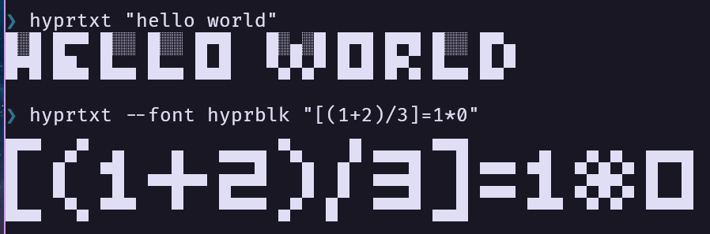

```txt
█░█ █▄█ █▀█ █▀█ ▀█▀ ▀▄█ ▀█▀
█▀█ ░█░ █▀▀ █▀▄ ░█░ █▀▄ ░█░
```

A minimalistic CLI tool to render text to the console using a custom 'hyprfont' figlet font.

---

## Features

- Render supported text in a 2-row Unicode block font.
- Output the font as a figlet `.flf` file.
- Check if any characters in the input are missing from the font.
- Show a gallery of the characters supported by the font.

Input is converted to lowercase before rendering.
Unsupported characters are omitted. Use `--missing` to identify them.

---

## Usage

```sh
hyprtxt [options] [text]
```

### Options

| Flags              | Description                                    |
|--------------------|------------------------------------------------|
| `-p`, `--prefix`   | Prefix each output line                        |
| `-P`, `--postfix`  | Postfix each output line                       |
| `-f`, `--figlet`   | Output the embedded font in figlet format      |
| `-m`, `--missing`  | Show unsupported characters in the input       |
| `-c`, `--charset`  | Print supported character set                  |
| `-e`, `--examples` | Print all characters as a glyph gallery        |
| `-v`, `--version`  | Show version info                              |
| `-h`, `--help`     | Show help message                              |

---

## Examples

```sh
% hyprtxt "hello world"
█░█ █▀▀ █░░ █░░ █▀█   █░▄░█ █▀█ █▀█ █░░ █▀▄
█▀█ ██▄ █▄▄ █▄▄ █▄█   ▀▄▀▄▀ █▄█ █▀▄ █▄▄ █▄▀

% hyprtxt --missing "{ oh no !¡}"
Unsupported characters:
{, ¡, }

% hyprtxt --figlet > hyprfont.flf
```

Screenshot. Font is [FiraCode Nerd Font Mono](https://github.com/tonsky/FiraCode).


---

## Development

### Build

```sh
make build
```

### Run

```sh
make run ARGS="hello world"
```

---

## License

MIT © 2025 [Mark Pustjens](mailto:pustjens@dds.nl)

